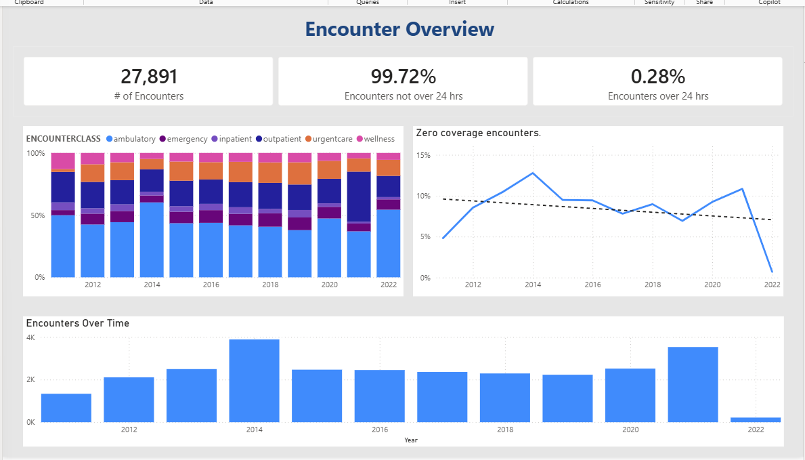
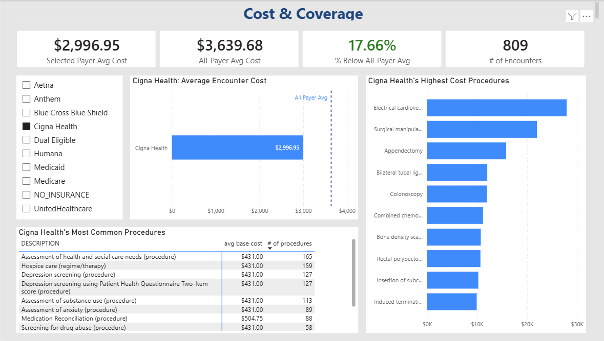
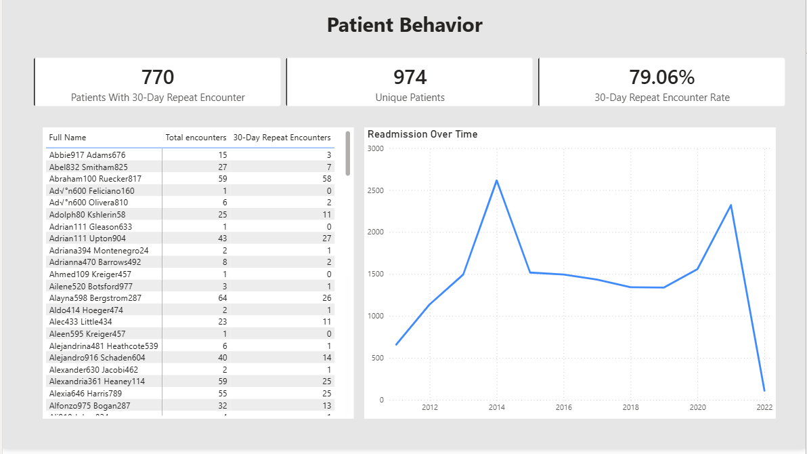

# Healthcare Encounters Power BI Analysis

## Project Overview

This Power BI project analyzes healthcare encounter data across encounter volume, payer cost differences, procedure trends, and 30-day repeat encounter behavior.

The goal was to build a portfolio-ready dashboard that answers practical healthcare operations questions using Power BI, DAX, and interactive report design.

## Dashboard Pages

### 1. Encounter Overview

This page summarizes overall encounter volume, unique patients, encounter duration, and encounter class mix over time.

### 2. Cost & Coverage

This page compares selected payer average encounter cost against the all-payer benchmark. It also highlights common procedures and highest-cost procedures for the selected payer.

### 3. Patient Behavior

This page analyzes unique patients, 30-day repeat encounters, repeat encounter rate, and patients with the highest repeat encounter counts.

## Key Metrics

- Total encounters: 27,891
- Unique patients: 974
- Patients with a 30-day repeat encounter: 770
- 30-day repeat encounter rate: 79.06%
- Average total encounter cost: $3,639.68

## Analysis Questions

### Encounter Overview

- How many total encounters occurred each year?
- What percentage of encounters belonged to each encounter class?
- What percentage of encounters were over 24 hours versus under 24 hours?

### Cost & Coverage

- How does selected payer average cost compare to the all-payer average?
- Which procedures are most common?
- Which procedures have the highest average base cost?

### Patient Behavior

- How many unique patients were admitted over time?
- How many patients had a repeat encounter within 30 days?
- Which patients had the most 30-day repeat encounters?

## Tools Used

- Power BI
- Power Query
- DAX
- Data modeling
- Interactive slicers and dynamic titles

## DAX / Modeling Highlights

This project used DAX measures for:

- Total encounters
- Unique patients
- Average encounter cost
- Selected payer average cost
- All-payer benchmark cost
- Difference vs all-payer average
- 30-day repeat encounter logic
- Patient repeat encounter rate
- Dynamic visual titles

## Notes

For this project, a "30-day repeat encounter" is defined as an encounter occurring within 30 days of a previous encounter for the same patient. Because the dataset includes encounter records broadly, this metric is interpreted as repeat utilization rather than confirmed inpatient hospital readmission.

## Project Status

Completed as part of a weekly Power BI portfolio-building practice.
